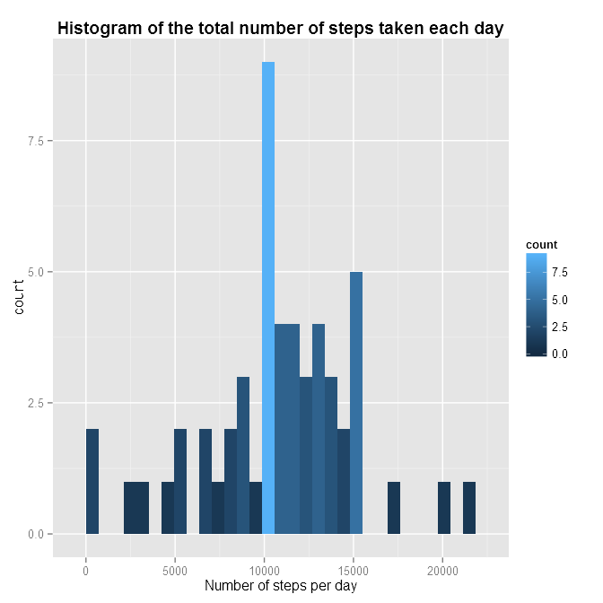
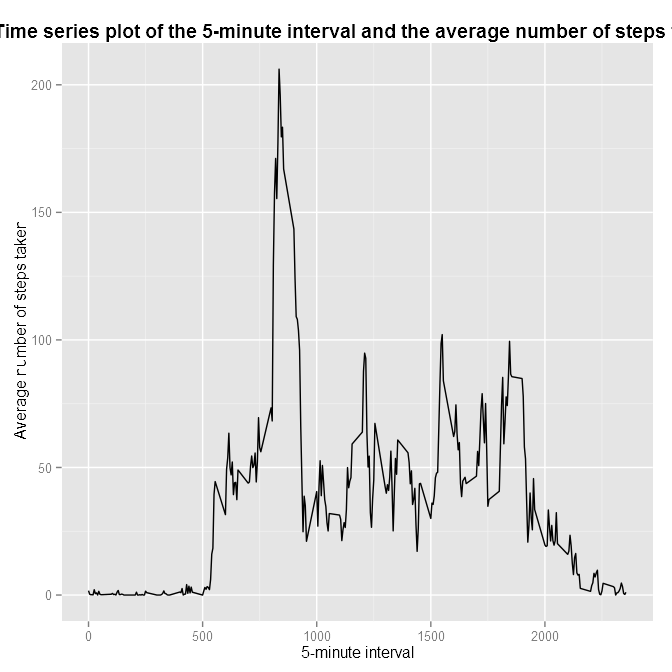
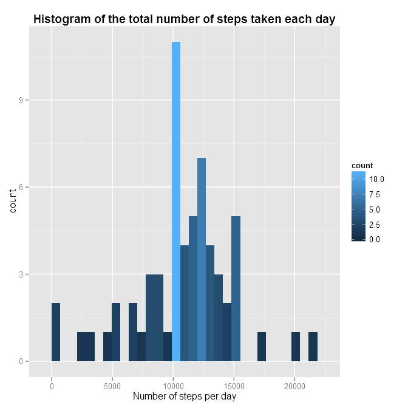
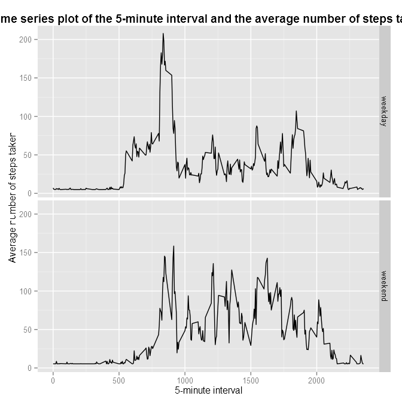

<!-- Make sure that the knitr package is installed and loaded. -->


<!-- Set options and folders. -->


<!-- Code for final HTML. -->

# Reproducible Research: Peer Assessment 1

## Loading and preprocessing the data


```r
# Open data from zip file
activity <- read.table(unz("activity.zip", "activity.csv"), header = T, sep = ",", 
    stringsAsFactors = F)

# Convert strings in date variable to date format
activity$date <- as.Date(activity$date)
```


## What is mean total number of steps taken per day?


```r
# Count total number of steps per day
total <- aggregate(activity$steps, by = list(Category = activity$date), FUN = sum)

# Use ggplot2 library to plot histogram
library(ggplot2)
qplot(x, data = total, geom = "histogram") + geom_histogram(aes(fill = ..count..)) + 
    xlab("Number of steps per day") + ggtitle("Histogram of the total number of steps taken each day") + 
    theme(plot.title = element_text(lineheight = 0.8, face = "bold"))
```

```
## stat_bin: binwidth defaulted to range/30. Use 'binwidth = x' to adjust this.
## stat_bin: binwidth defaulted to range/30. Use 'binwidth = x' to adjust this.
```

 

```r

# Calculate mean and median

mean(total$x, na.rm = T)
```

```
## [1] 10766
```

```r
median(total$x, na.rm = T)
```

```
## [1] 10765
```


## What is the average daily activity pattern?


```r
# Time series plot of the 5-minute interval and the average number of steps
# taken
AveStepPerInterval <- as.data.frame(tapply(activity$steps[complete.cases(activity)], 
    activity$interval[complete.cases(activity)], mean))
names(AveStepPerInterval) = c("ave")
ggplot(AveStepPerInterval, aes(x = as.numeric(rownames(AveStepPerInterval)), 
    y = ave)) + xlab("5-minute interval") + ylab("Average number of steps taken") + 
    ggtitle("Time series plot of the 5-minute interval and the average number of steps taken") + 
    theme(plot.title = element_text(lineheight = 0.8, face = "bold")) + geom_line()
```

 

```r

# Which 5-minute interval, on average across all the days in the dataset,
# contains the maximum number of steps?
names(which.max(AveStepPerInterval$ave))
```

```
## [1] "835"
```


## Imputing missing values

```r
# Calculate and report the total number of missing values in the dataset
table(is.na(activity))[2]
```

```
## TRUE 
## 2304
```

```r

# Create a new dataset that is equal to the original dataset but with the
# missing data filled in.  Our strategy is to replace NA values with mean of
# steps by day of week.
Sys.setlocale(locale = "C")
```

```
## [1] "C"
```

```r
activity$day <- weekdays(activity$date)
MeanStepsPerWeekDay <- aggregate(activity[complete.cases(activity), ]$steps, 
    by = list(Category = activity[complete.cases(activity), ]$day), FUN = mean)
imputed <- activity

for (i in 1:nrow(imputed)) {
    if (is.na(imputed$steps[i])) {
        imputed$steps[i] <- MeanStepsPerWeekDay$x[MeanStepsPerWeekDay$Category == 
            activity$day[i]]
    }
}

total <- aggregate(imputed$steps, by = list(Category = imputed$date), FUN = sum)

qplot(x, data = total, geom = "histogram") + geom_histogram(aes(fill = ..count..)) + 
    xlab("Number of steps per day") + ggtitle("Histogram of the total number of steps taken each day") + 
    theme(plot.title = element_text(lineheight = 0.8, face = "bold"))
```

```
## stat_bin: binwidth defaulted to range/30. Use 'binwidth = x' to adjust this.
## stat_bin: binwidth defaulted to range/30. Use 'binwidth = x' to adjust this.
```

 

```r


mean(total$x)
```

```
## [1] 10821
```

```r
median(total$x)
```

```
## [1] 11015
```


We can see that values differ from the values calculated in the first part of this work.


## Are there differences in activity patterns between weekdays and weekends?


```r
# Create a new factor variable indicating whether a given date is a weekday
# or weekend day.
imputed$weekend <- as.factor(imputed$day %in% c("Saturday", "Sunday"))
levels(imputed$weekend) <- c("weekday", "weekend")

# Make a panel plot containing a time series plot of the 5-minute interval
# and the average number of steps taken, averaged across all weekday days or
# weekend days.

PlotData <- aggregate(steps ~ weekend + interval, data = imputed, FUN = mean)
ggplot(PlotData, aes(x = interval, y = steps)) + xlab("5-minute interval") + 
    ylab("Average number of steps taken") + ggtitle("Time series plot of the 5-minute interval and the average number of steps taken") + 
    theme(plot.title = element_text(lineheight = 0.8, face = "bold")) + facet_grid(weekend ~ 
    .) + geom_line()
```

 


